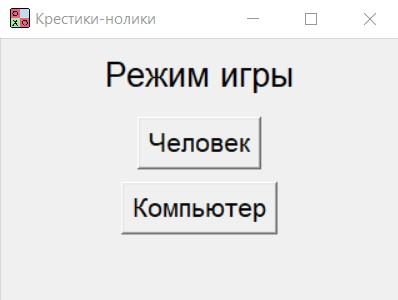
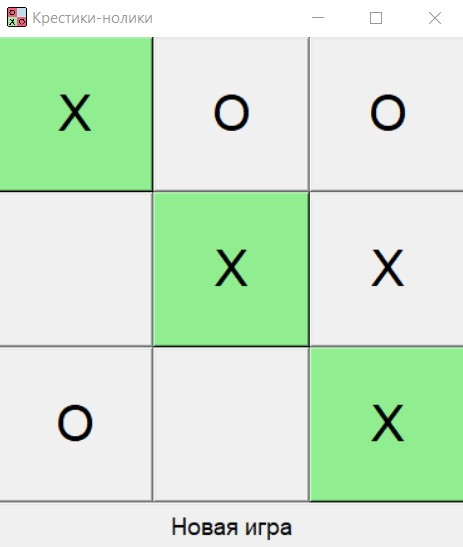
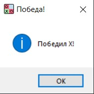

 Крестики-нолики на Python (Tkinter)

Графическая настольная игра "Крестики-нолики", написанная на Python с использованием библиотеки `tkinter`

---

## Возможности

- Игра против другого человека или против компьютера
- Бот (ИИ) делает случайные ходы
- Подсветка выигрышной комбинации
- Всплывающее сообщение о победе или ничьей
- Кнопка "Новая игра" для перезапуска
- Опционально — установка иконки окна

---

## Режимы игры

- **Против человека** — два игрока ходят по очереди
- **Против компьютера** — вы играете крестиками (X), бот — ноликами (O)

> Бот не использует стратегию. Он выбирает ходы **случайно**

---

## Интерфейс игры

### Главное меню

---

### Игровой процесс

---

### Победа

